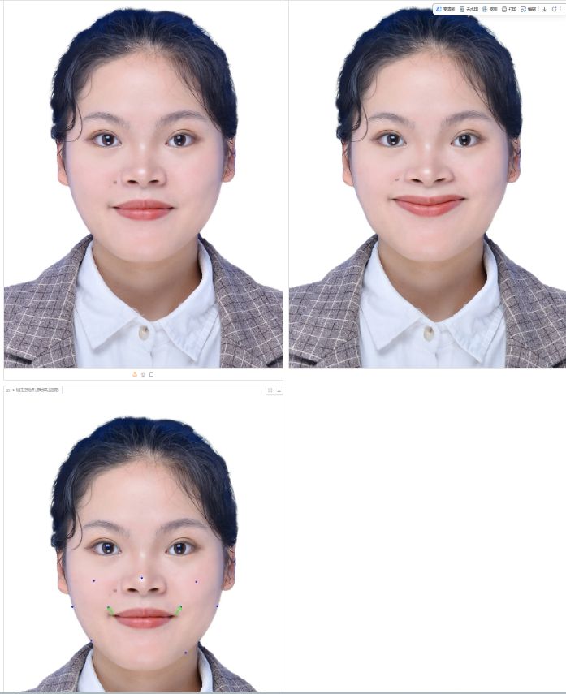
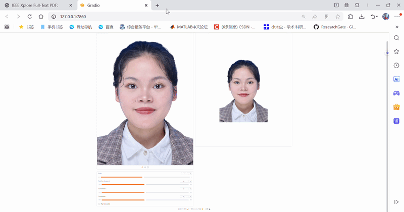
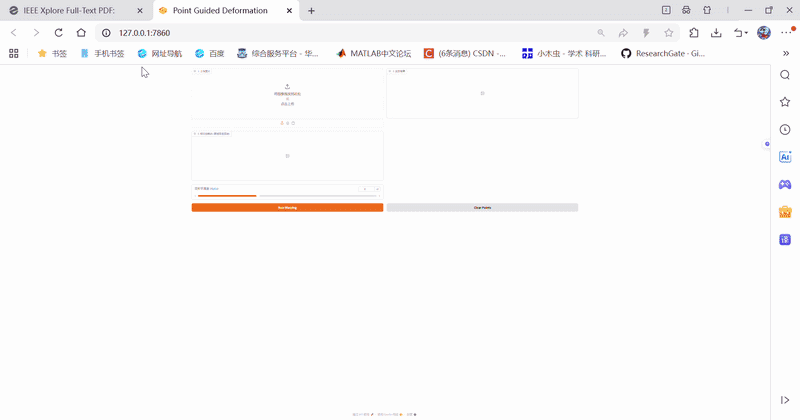

# Assignment 1 - Image Warping

### In this assignment, I finished 2  basic transformation and point-based deformation for images.

## Implementation of Image Geometric Transformation

This repository is Jialing Zhang's implementation of Assignment_01 of DIP. 



## Requirements

To install requirements:

```setup
python -m pip install -r requirements.txt
```


## Running

To run basic transformation, run:

```basic
python run_global_transform.py
```

To run point guided transformation, run:

```point
python run_point_transform.py
```

## Results (need add more result images)
### Basic Transformation


### Point Guided Deformation:


## Acknowledgement

>📋 Thanks for the algorithms proposed by [Image Deformation Using Moving Least Squares](https://people.engr.tamu.edu/schaefer/research/mls.pdf).
