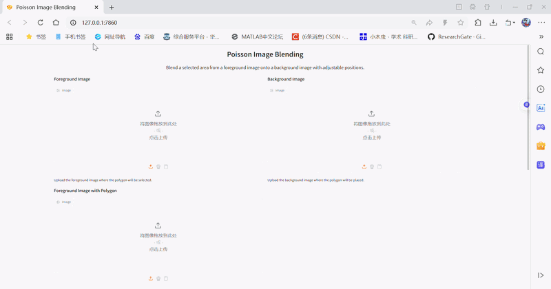
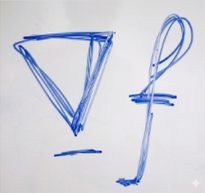
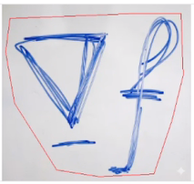
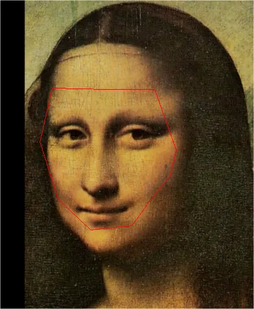
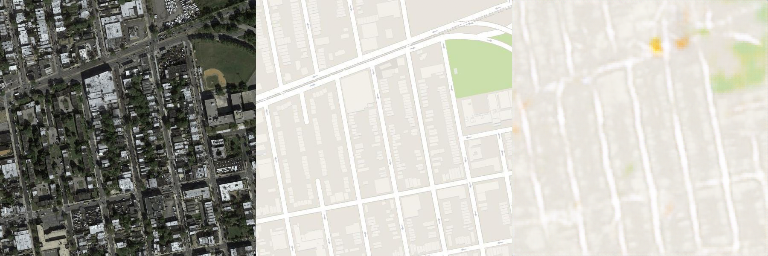

# Poisson Blending & Pix2Pix

This repository contains my implementation of [Poisson Blending](https://www.cs.jhu.edu/~misha/Fall07/Papers/Perez03.pdf) and [ Pix2Pix](https://arxiv.org/abs/2030.12345) for my image processing coursework.


## Requirements（Conda Recommended）

To install requirements:

```setup
# Create a new environment with Python 3.10
conda create -n DIP python=3.10 -y
conda activate DIP

# Install PyTorch with CUDA 12.1 support
# Note: Ensure your NVIDIA driver supports CUDA 12.1 or higher
conda install pytorch torchvision torchaudio pytorch-cuda=12.1 -c pytorch -c nvidia -y

# Install other necessary libraries
conda install gradio opencv numpy pillow -c conda-forge -y
```


## Training
### 1. Poisson Blending (Interactive App)

This task uses a Gradio-based interface allowing users to manually define regions and perform real-time blending optimization.
To train the model, run this command:

```
python run_blending_gradio.py 
```

### 2. Pix2Pix Model Training
Train the model to translate map tiles into satellite imagery using the Google Maps dataset.

Step A: Prepare the Dataset
Option 1: Automatic Download (if available)
```
bash download_maps_dataset.sh
```
Option 2: Manual Setup (Local)

If the script fails, download the dataset manually to the ./datasets/maps directory. Then, generate the necessary file lists by running:
```
# Generate training and validation lists
find ./datasets/maps/train -name "*.jpg" > train_list.txt
find ./datasets/maps/val -name "*.jpg" > val_list.txt
```
Step B: Run Training

To train the model from scratch:
```train
python train.py 
```
| Parameter | Value | Description |
| :--- | :--- | :--- |
| **Model** | FullyConvNetwork (FCN) | A Fully Convolutional Network with Skip Connections (U-Net style) to preserve spatial details. |
| **Batch Size** | 100 | Number of images per training step |
| **Total Epochs** | 300 | Total training iterations |


## Evaluation
### 1. Poisson Blending (Qualitative Evaluation)

#### Upload images and observe the seamlessness of the boundaries and color consistency in the output.

#### The optimization progress (Loss values) will be printed in the console during the 5,000 iterations.

### 2. Pix2Pix

#### Visual Check: Every 5 epochs, the model generates comparison images in the val_results/ folder. You can inspect these to see how well the model translates maps to satellite images.

#### L1 Loss: The validation loss is printed in the terminal at the end of each epoch. A lower L1 loss indicates better pixel-level reconstruction.

To run the validation logic specifically (using your current train.py structure), you can simply observe the final epoch's output:

```eval
# The final model checkpoint is saved here:
./Pix2Pix/train_results/epoch_295
```


## Pre-trained Models

You can download the trained model weights to skip the training process:


- **Pix2Pix  Checkpoint**: 
    
    The trained model is included in this repository. You can find it at:
    `./checkpoints/pix2pix_model_epoch_300.pth`
    - **Training Details**: Trained for 300 epochs on the Maps dataset using Adam optimizer (LR=0.001).
    - **Usage**: Place the `.pth` file in the `checkpoints/` directory to use it for inference or evaluation.


## Results
### 1. Poisson Blending
The following GIF demonstrates the interactive process of selecting a source region and blending it seamlessly into a target background using our Gradio web interface.









### 2. Pix2Pix on Maps Dataset

| Dataset | Loss Function | Total Epochs | Final Validation Loss (MAE) |
| :--- | :--- | :--- | :--- |
| Google Maps | `nn.L1Loss()` | 300 | **0.0661** |

**Observations:**
The model reached a stable convergence after approximately 250 epochs, with the pixel-wise mean absolute error (L1 Loss) stabilizing at around 0.066.

The following image is a sample from the **validation set** after 300 epochs of training. It demonstrates the model's ability to generalize to unseen map layouts.




## Contributing

>This project is licensed under the MIT License. You are free to use, modify, and distribute the code for academic and non-commercial purposes.