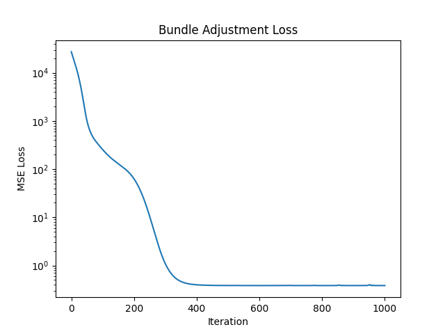
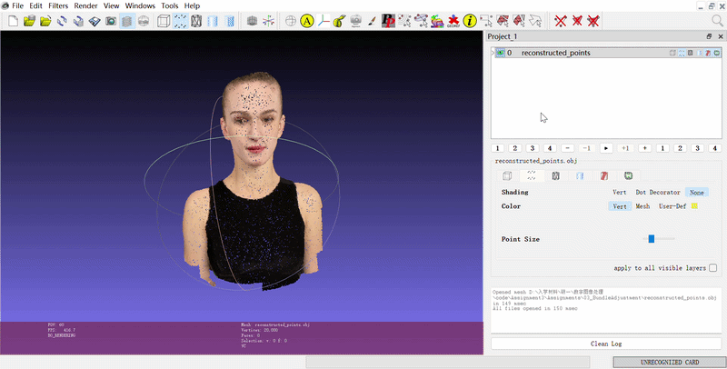
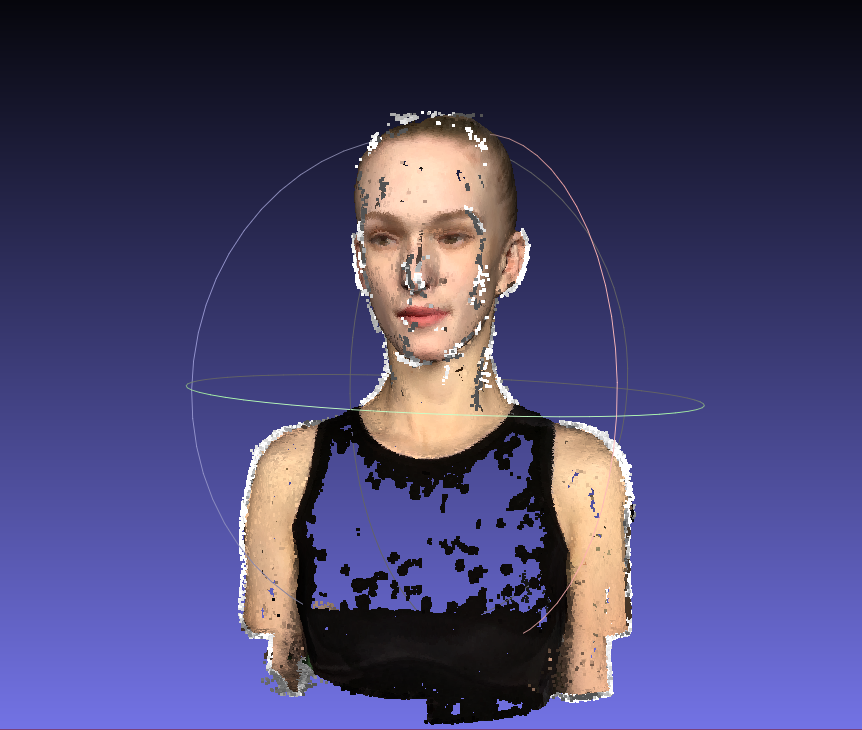
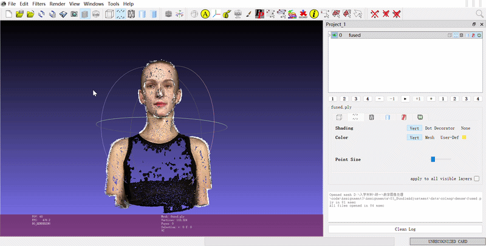

# Assignment 3: Bundle Adjustment & 3D Reconstruction

### 本项目包含两个部分：(1) 使用 PyTorch 从零实现 Bundle Adjustment 优化器；(2) 使用 COLMAP 命令行工具对多视图图像进行完整的三维重建。

### Resources:
- [Teaching Slides](https://pan.ustc.edu.cn/share/index/66294554e01948acaf78)
- [Bundle Adjustment — Wikipedia](https://en.wikipedia.org/wiki/Bundle_adjustment)
- [PyTorch Optimization](https://pytorch.org/docs/stable/optim.html)
- [pytorch3d.transforms](https://pytorch3d.readthedocs.io/en/latest/modules/transforms.html)
- [COLMAP Documentation](https://colmap.github.io/)
- [COLMAP Tutorial](https://colmap.github.io/tutorial.html)

---

### Requirements

#### 1. Python 环境
推荐使用 `conda` 创建隔离环境，并安装必要的深度学习与几何处理库：
```bash
# 创建环境
conda activate DIP #使用上一次作业的环境

# 安装基础库
pip install numpy matplotlib

# 安装 PyTorch3D (用于旋转矩阵转换)
conda install PyTorch3D
#我用版本：pytorch3d 0.7.9 cpu_py310hc9fd358_4 conda-forge
```


#### 2.COLMAP 安装
1、从 [COLMAP Releases](https://github.com/colmap/colmap/releases) 下载 COLMAP-dev-windows-cuda.zip。

2、解压后将 bin 目录路径加入系统环境变量 Path。

3、脚本配置：修改 run_colmap.sh 中的 COLMAP_EXE 变量，指向你本地的 colmap.exe 路径。


### Training/Run
#### 1、Bundle Adjustment (Task 1)
```
python Bundle\ Adjustment.py
```
#### 2、使用 COLMAP 进行三维重建 (Task 2)
```
bash run_colmap.sh
```
### Results

### 1. Task 1: BA 优化结果

| Loss 收敛曲线 (对数坐标) | 最终重建的 3D 点云 (GIF 动图) |
| :---: | :---: |
|  |  |
| *描述：使用对数坐标系展示。Loss 从初始的约 20000 降至约 0.4 并达到收敛。在 400 次迭代附近 Loss 趋于平缓。* | *描述：生成带颜色的点云模型，结构完整* |
### 2. Task 2: COLMAP 三维重建结果

本部分展示了通过 COLMAP 完整管线恢复出的稠密三维点云。

| 重建点云全景  | 动态效果演示  |
| :---: | :---: |
|  |  |
| *图 2.1: 稠密点云在 MeshLab 中的全景展示* | *图 2.2: 重建模型的 360° 旋转细节预览* |

缺陷分析：重建模型在胸口区域出现模糊，主要是由于该区域纹理匮乏 (Weak Texture) 以及渲染时的光照不均导致的。这反映了传统 MVS 算法在处理纯色、弱纹理表面时的局限性，需依赖更复杂的先验或更丰富的特征信息来改善。

**结果分析：**
- **重建质量**：通过 COLMAP 的 `Patch Match Stereo` 流程，成功从 50 张图像中恢复了高密度的头部几何表面。
- **相机恢复**：稀疏重建阶段成功解算出了 50 个视角的内参和外参。
- **文件产出**：最终生成的稠密点云已保存为 `fused.ply`，可在 MeshLab 中进行全方位观测。


