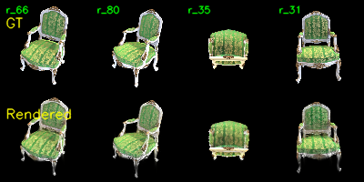
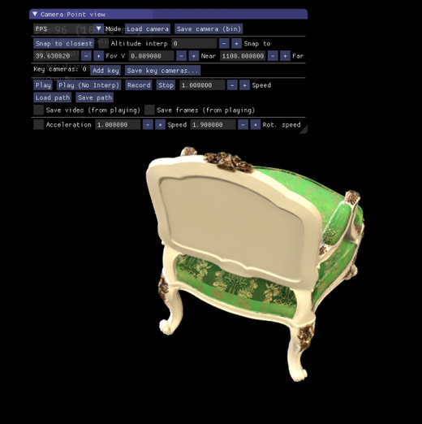

# Assignment 4 - Implement Simplified 3D Gaussian Splatting

### In this assignment, I will implement a simplified version of 3D Gaussian Splatting (3DGS) in pure PyTorch — a complete pipeline that reconstructs a 3D scene from multi-view images via differentiable rasterization of 3D Gaussians.

### Resources:
- [Paper: 3D Gaussian Splatting for Real-Time Radiance Field Rendering](https://repo-sam.inria.fr/fungraph/3d-gaussian-splatting/3d_gaussian_splatting_low.pdf)
- [3DGS Official Implementation](https://github.com/graphdeco-inria/gaussian-splatting)
- [COLMAP — Structure-from-Motion](https://colmap.github.io/)
- [Teaching Slides](https://pan.ustc.edu.cn/share/index/66294554e01948acaf78)

---

### Background

3D Gaussian Splatting 将场景表示为一组带颜色和不透明度的 3D 高斯，通过将其投影到图像平面做 α-blending 实现可微体渲染。本作业将带你从零实现一个**简化版** 3DGS（不含 tile-based rasterizer 和 adaptive densification），完整体验 pipeline：相机参数恢复 → 3D 高斯参数化 → 投影 → α-blending。

### Data

```
data/
├── chair/images/   # 100 张 multi-view 渲染图像
└── lego/images/    # 100 张 multi-view 渲染图像
```

下面实现以 `chair` 为例

---
# Training
## Task 1: Structure-from-Motion with COLMAP

使用 COLMAP 恢复相机内外参，并得到一组稀疏 3D 点作为 3DGS 的初始化：

```bash
python mvs_with_colmap.py --data_dir data/chair
```

将恢复的 3D 点重投影回各视角进行验证：

```bash
python debug_mvs_by_projecting_pts.py --data_dir data/chair
```

---

## Task 2: Simplified 3D Gaussian Splatting (主要部分)

观察 Task 1 的输出可以发现，COLMAP 恢复的 3D 点对于稠密渲染来说过于稀疏。我们将每个点扩展为一个 3D 高斯，使其覆盖周围空间。

### Train your 3DGS

训练：

```bash
python train.py --colmap_dir data/chair --checkpoint_dir data/chair/checkpoints
```

### Render a Multi-view Video (Optional)

训练完成后，可用 [render_3dgs_mv.py](render_3dgs_mv.py) 沿一个绕场景中心的**水平圆轨迹**渲染一段连续视角视频，便于直观检查重建质量：

```bash
python render_3dgs_mv.py \
    --colmap_dir data/chair \
    --checkpoint data/chair/checkpoints/checkpoint_000060.pt \
    --num_frames 240 --fps 30
# 默认输出: <colmap_dir>/render_mv.mp4
```

up 轴由训练相机的 y 轴平均自动估计（NeRF 合成数据图像均为正放），orbit 半径与高度取训练相机的均值。

---

## Task 3: Compare with the Official 3DGS Implementation

使用相同数据集运行 [官方 3DGS](https://github.com/graphdeco-inria/gaussian-splatting)。

---

# Results:
## 1. Task 1: Structure-from-Motion 可视化
本任务通过 COLMAP 恢复相机参数，并利用稀疏点云进行 3DGS 初始化。

* **重投影验证**:

  **
  > **分析**: 验证结果显示，重投影点与原始图像特征对齐良好，证明了相机内外参恢复的准确性，为后续的 Gaussian 初始化提供了可靠的空间基准。

---

## 2. Task 2: 简化版 3DGS 训练结果
本任务实现了 3DGS 的核心渲染管线。


* **渲染展示**:
  **
* **多视角视频**:
  *[点击观看多视角渲染视频](data/chair/checkpoints/debug_rendering.mp4)*
  > **分析**: 渲染结果表明模型成功学习了场景的颜色与几何表示，能够实现平滑的视点切换。

---

## 3. Task 3: 与官方 3DGS 的性能对比与分析

为了深入理解 3DGS 的实现差异，我对比了本实现（Pure PyTorch）与官方 3DGS（CUDA 实现）在同等硬件条件下的表现。

### 3.1 性能数据对比表

| 指标 | 简化版 (Pure PyTorch) | 官方 3DGS (CUDA) | 差异来源核心点 |
| :--- | :--- | :--- | :--- |
| **渲染质量** |  | （使用官方代码渲染，显存占用极大，所以改用使用软件查看）| 高斯密度管理策略 |
| **训练速度 (s/iter)** | 几个小时（迭代200次） | 十几分钟（迭代30000次） | CUDA Kernel 并行化 |
| **显存占用 (GB)** | 小于24GB | 非常大 | Tile-based 渲染优化 |

### 3.2 差异来源深入讨论

#### A. 渲染质量与密度管理
* **现象**: 我的简化版在复杂几何边缘处存在模糊与伪影，且无法填补初始点云分布不均导致的空洞。
* **原因**: 官方实现的核心在于 **Adaptive Densification**。它通过监控梯度信息，在渲染不准确的区域自动分裂或克隆高斯，实现了几何的动态优化。而我的简化版仅保留了初始的稀疏点云，缺乏这种自适应增长机制。

#### B. 训练速度与计算优化
* **现象**: 官方实现训练速度远快于简化版。
* **原因**: 简化版依赖 PyTorch 的自动求导与 Python 循环，存在较大的 Kernel Launch 开销。官方实现通过 **定制的 CUDA Kernels**，直接在 GPU 底层完成高斯投影与混合，消除了 Python 解释器的性能损耗，实现了亚毫秒级的渲染响应。

#### C. 显存占用与渲染架构
* **现象**: 简化版随场景高斯数量增加，显存占用呈线性增长；官方实现则更加平稳。
* **原因**: 官方采用了 **Tile-based Rasterizer**。它将图像切分为 $16 \times 16$ 的小块 (Tile)，通过排序算法仅处理每个 Tile 内可见的高斯，大幅减少了计算冗余和显存占用。我的实现采用了简单的全局排序，导致每次前向/反向传播都需要对所有高斯进行全图操作。

---

## 4. 结论与反思
本次实验成功复现了 3DGS 的基础原理，验证了可微体渲染的有效性。

